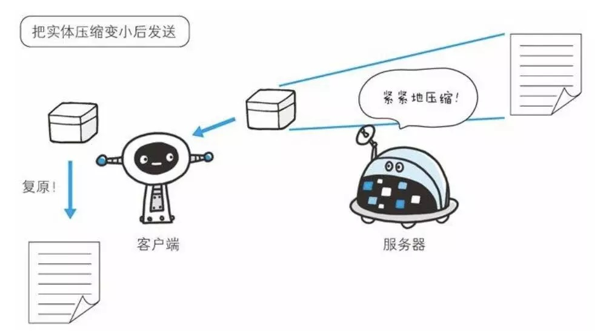
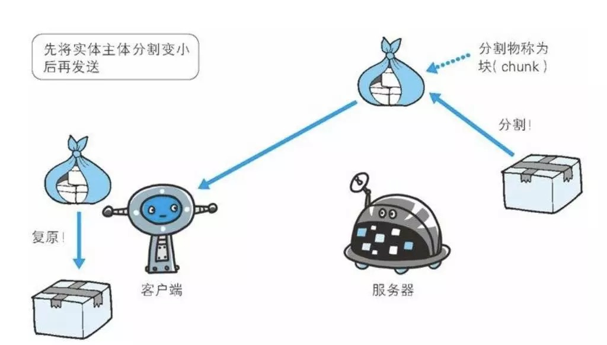

# HTTP

## 网络基础
TCP/IP 通信传输流，利用TCP/IP协议簇进行网络通信时，通过分层顺序与对方进行通信。发送端从应用层往下走，接收端从链路层往上走。

## HTTP协议
HTTP设计的简单实用，重点有这几个：
1. 无状态协议。协议本身并不保留之前的请求或者响应的报文。因此后来引入了cookie，token之类的来保持状态。
2. URI定位资源。设计程序时候，应该注意URL路径的设计。
3. 持久连接和管线化。1次TCP连接，多次HTTP请求和响应。对于同一个域名chrome支持6个TCP连接。
[开发文档](https://developers.google.com/web/tools/chrome-devtools/network-performance/reference#timing)

## HTTP报文
请求报文和响应报文。
报文分为两部分：header和body。我们可以随意打开一个网站，然后查看chrome开发者工具里的network。

### 持久连接
通过 Connection: keep-alive 这个头部来实现，服务端和客户端都可以使用它告诉对方在发送完数据之后不需要断开 TCP 连接。
浏览器重用已经打开的空闲持久连接，可以避开缓慢的三次握手，还可以避免遇上 TCP 慢启动的拥塞适应阶段。

### 传输
- 压缩传输内容: content-encoding: gzip

- 实体长度：Content-Length

性能优化的指标TTFB(Time To First Byte),是从客户端发出请求到收到响应的第一个字节所花费的时间。服务端为了计算响应实体长度而缓存所有内容。
更好的处理方法是，产生一块数据，就发送一块，采用"流模式"（stream）取代"缓存模式"（buffer）。

- 分块传输: Transfer-Encoding: chunked

在传输大容量的数据时，通过把数据分割成多块，能够让浏览器逐步显示页面。

### 缓存
- expires

expires是使用绝对时间。它是相对于服务器上的时间而言的，定义为资源的失效时刻，但是要做出对比的是客户端的时间。一旦客户端的时间和服务器的时间不一致。那缓存也就不能保证准确了。

- cache-control

当cache-control有指定的max-age时候，会优先处理max-age。
Public：指示响应可被任何缓存区缓存。 
Private：指示对于单个用户的整个或部分响应消息，不能被共享缓存处理。这允许服务器仅仅描述当前用户的部分响应消息，此响应消息对于其他用户的请求无效。 
no-cache：指示请求或响应消息不能缓存 
no-store：用于防止重要的信息被无意的发布。在请求消息中发送将使得请求和响应消息都不使用缓存。 
max-age：指示客户机可以接收生存期不大于指定时间（以秒为单位）的响应。 

- etag&if-none-match

当客户端在很短的时间内再次访问上面的 URL，客户端浏览器会使用 If-* 请求头。
如 If-None-Match 检查 ETag 的内容是否有改变。也就是说，如果 ETag 发生变化，客户端接收到的一个完整的新响应；如果 ETag 没变化，客户端接收到的是一个表明内容没变化的标识。

### 其他
1. Authorization

请求消息头含有服务器用于验证用户代理身份的凭证，通常会在服务器返回401 Unauthorized 状态码以及WWW-Authenticate 消息头之后在后续请求中发送此消息头。

2. User-Agent

User-Agent的值是：用户使用的客户端的一些必要信息，比如操作系统、浏览器及版本、浏览器渲染引擎等。

3. Via

该字段是为了追踪请求和响应报文测传输路径，报文经过代理或者网关是会在Via字段添加该服务器的信息，然后再进行转发。

### 自行扩展
HTTP 首部字段是可以自行扩展的，所以有时候你会看到一些非标准的首部字段：X-Frame-Options, X-XSS-Protection, DNT。
很多自定协议都有X-前缀, 现在这种做法已经被废除。
