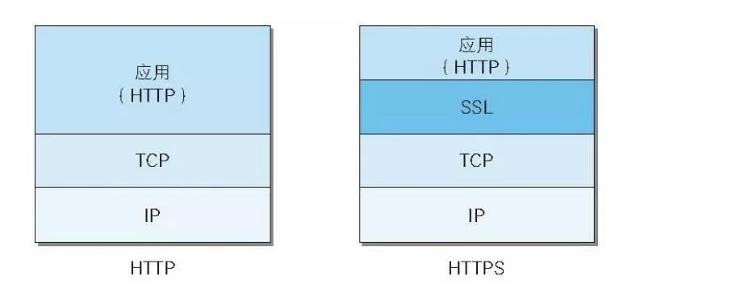
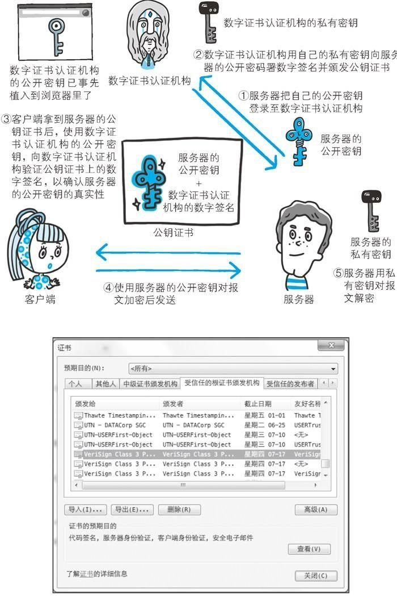
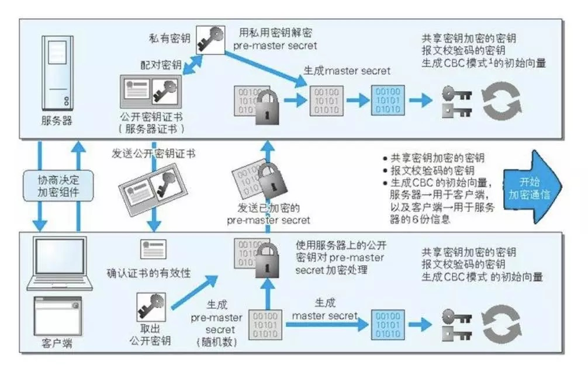

# HTTPS
HTTP简单，方便还很实用。但它也有不足之处：
1. 通信使用明文，内容会被窃听。
2. 不验证对方身份，可能遭遇伪装。
3. 没有验证报文完整性，可能被篡改。
也就像我们会遇到这三种行为：窃听，诈骗，劫持

### 通信使用明文可能会被窃听
按TCP/IP协议族的工作机制,通信内容在所有的通信线路上都有可能遭到窥视。即使你对内容加密了，也同样可以拿到你加密后的内容。然后寻求破解。
最常见的就是抓包器，嗅探工具。

### 通信方的身份可能遭遇伪装
在HTTP协议通信的，由于不存在确认通信方的处理步骤，任何人都可以发起请求。同时，不论谁发送过来的请求都会返回响应。
因此有可能和你通信的是伪装的web服务器，或者是伪装的客户端。

### 无法验证报文的完整性可能被篡改
在请求和响应在传输途中，遭到攻击者拦截并篡改内容，也叫中间人攻击。而表面上客户端和服务器之间的通信是正常的。

## HTTPS=HTTP+加密+认证+完整性保护
HTTPS是身披SSL外壳的HTTP。采用SSL协议，HTTP就拥有了HTTPS的加密，证书和完整性保护这些功能。

那些问题解决了吗？

### 混合加密机制
1. 如果直接使用对称加密，那秘钥怎么从客户端到服务器并保证是正确的呢？
2. 使用非对称加密共享秘钥，然后用共享秘钥通信。那如何保证客户端使用的公钥是正确的，没被篡改过呢？
3. 那就需要证明公钥正确的数字证书。

### MAC报文摘要
应用层发送数据时会附加一种MAC(Message Authentication Code)的报文摘要。MAC能够查知报文是否遭到篡改，从而保护了报文的完整性。

### 整个流程

